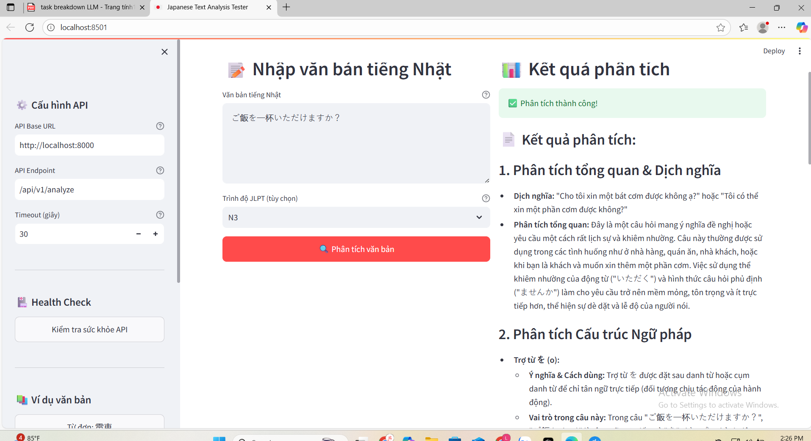

# 🇯🇵 Hướng dẫn Test Japanese Text Analysis API


> 🎯 **Mục tiêu**: Test API phân tích văn bản tiếng Nhật thông qua giao diện web

---

## 🚀 Cách sử dụng

### 1. Khởi động ứng dụng
```bash
# Cài đặt dependencies
pip install -r requirements_streamlit.txt

# Chạy ứng dụng
streamlit run test_app.py
```

### 2. Truy cập giao diện
Mở trình duyệt và truy cập: **http://localhost:8501**



> 💡 **Giao diện chính**: Ứng dụng có 2 cột - sidebar cấu hình bên trái và khu vực test bên phải

## 📝 Cách test

### Bước 1: Kiểm tra API 🏥
- Nhấn nút **"Kiểm tra sức khỏe API"** trong sidebar
- Đảm bảo hiển thị "✅ API hoạt động bình thường"

### Bước 2: Nhập văn bản test 📝
- Nhập văn bản tiếng Nhật vào ô **"Văn bản tiếng Nhật"**
- Chọn trình độ JLPT (tùy chọn)
- Nhấn nút **"🔍 Phân tích văn bản"**

### Bước 3: Xem kết quả 📊
- Kết quả phân tích sẽ hiển thị dưới dạng markdown đẹp mắt
- Có thể xem dữ liệu JSON gốc bằng cách mở phần **"🔧 Xem dữ liệu JSON gốc"**


## 🧪 Các test case cần thực hiện
### ✅ Test 1: Từ đơn có Hán tự 🚃
**Nhập**: `電車`
**Trình độ**: N5
**Kết quả mong đợi**: Phân tích từ "tàu điện", giải thích Hán tự 電 (điện) và 車 (xe)

### ✅ Test 2: Từ Hiragana 📚
**Nhập**: `たくさん`
**Trình độ**: N5
**Kết quả mong đợi**: Phân tích từ "nhiều, rất nhiều", loại từ và cách sử dụn

### ✅ Test 3: Cụm từ 🗾
**Nhập**: `日本の文化`
**Trình độ**: N3
**Kết quả mong đợi**: Phân tích cụm từ "văn hóa Nhật Bản", cấu trúc ngữ pháp


### ✅ Test 4: Câu đơn giản 👨‍🎓
**Nhập**: `私は学生です。`
**Trình độ**: N5
**Kết quả mong đợi**: Dịch "Tôi là học sinh", phân tích cấu trúc câu

### ✅ Test 5: Câu phức tạp 🧠
**Nhập**: `池田さんは木村さんを疑っているようだ。`
**Trình độ**: N2
**Kết quả mong đợi**: Dịch và phân tích ngữ pháp phức tạp


### ✅ Test 6: Câu nghi vấn lịch sự 🍚
**Nhập**: `ご飯を一杯いただけますか？`
**Trình độ**: N3
**Kết quả mong đợi**: Phân tích cấu trúc lịch sự, giải thích mức độ lịch sự


### ✅ Test 7: Lỗi validation ❌
**Nhập**: `Em ăn cơm chưa`
**Kết quả mong đợi**: Hiển thị lỗi "Text must contain valid Japanese characters"


### ✅ Test 8: Văn bản rỗng ⚠️
**Nhập**: (để trống)
**Kết quả mong đợi**: Hiển thị lỗi "Text cannot be empty"


## 📊 Checklist đánh giá


### 🎯 Chất lượng phân tích
- [ ] Dịch nghĩa chính xác
- [ ] Giải thích rõ ràng bằng tiếng Việt
- [ ] Phân tích Hán tự chi tiết (nếu có)
- [ ] Câu ví dụ phù hợp
- [ ] Phân tích ngữ pháp đúng


### ⚡ Hiệu năng
- [ ] Thời gian phản hồi < 5 giây
- [ ] Giao diện mượt mà, không lag
- [ ] Không bị timeout


### 🛡️ Xử lý lỗi
- [ ] Thông báo lỗi rõ ràng
- [ ] Không crash khi có lỗi
- [ ] Validation hoạt động đúng
